<!-- Dual Terminal Header: Left = AV Perception Simulator (425px), Right = Neofetch Info Card (425px) -->
<table>
<tr>
<td valign="top"></td>
<td valign="top"></td>
</tr>
</table>

## Bayu Satrio Wibowo

**Informatics @ Telkom University · Autonomous Vehicle Researcher · Robotics & Embedded**

  
  
  
  

<!-- Live AV System Telemetry HUD -->

 

<!-- Animated Contribution Terminal Heatmap (Daily Automated Workflow) -->

